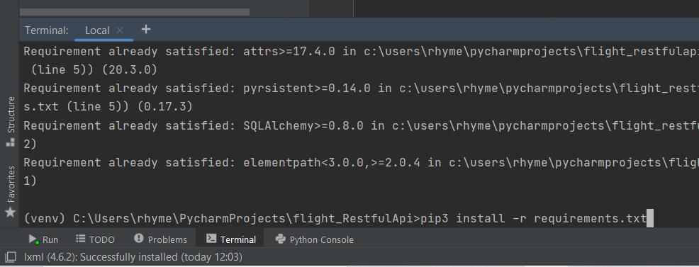

# flight_RestfulApi
 Database driven RESTFUl API in python

Programming language : Python 3

Required IDE : PyCharm

Python interpreter used: Python 3.8

- See "images/python interpreter".png file for details if necessary.

Database software used : DB Browser for SQLite

- Locate database in "sqlite3/Flights_db.db"

This Repo includes database used for API as well as  testData file, schemas.  

**Take note : A python interpreter might be needed to set. Also path to the SQLite database in my code (main.py) might be different from yours. A path change might be necessary.**

Pull this repository and open in PyCharm.

In PyCharm IDE, locate the Terminal. In the terminal use command: 
		`pip3 install -r requirements.txt ` 
		to install the necessary libraries/packages for the API.

​		Another way to install requirements is to hover mouse pointer over any of the text in the `requirements.txt` file. This gives a small 		box that allows you to install that specific library or package.

